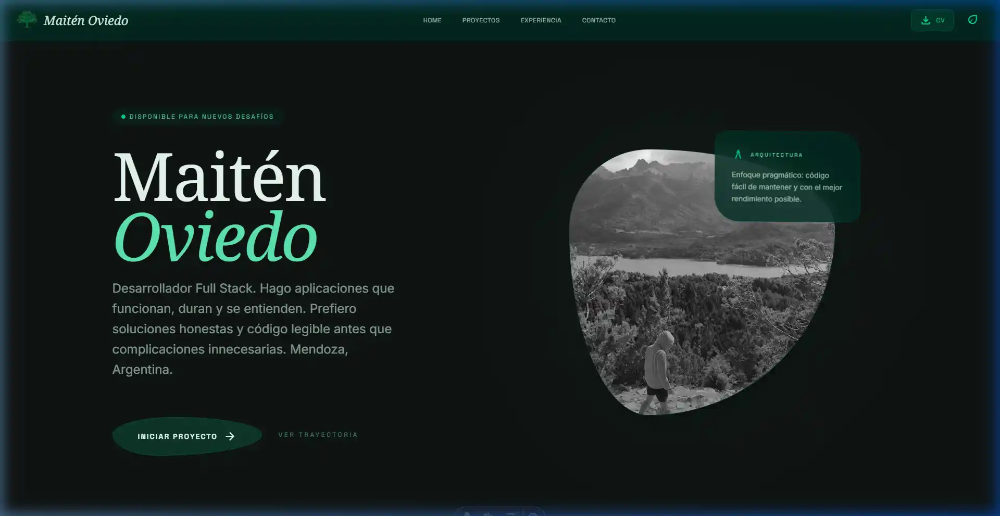

# Portfolio Personal - Maiten Oviedo

Portfolio de alto rendimiento con estética **Bioluminescent Architect**, diseñado para reflejar una ingeniería honesta y escalonada. Construido con **Astro 5**, **Tailwind CSS 4** y **Bun**.

## 🚀 Tecnologías Utilizadas

- **[Astro 5](https://astro.build/)** - El framework web para la era moderna, optimizado para Web Vitals.
- **[TypeScript](https://www.typescriptlang.org/)** - Tipado estático para un código robusto y mantenible.
- **[Tailwind CSS v4](https://tailwindcss.com/)** - Estilado de última generación con variables CSS nativas.
- **[Bun](https://bun.sh/)** - Runtime y gestor de paquetes de alto rendimiento.

## ✨ Características

### Secciones Principales
- **Hero** - Presentación de alto impacto con 3D interactivo y tipografía Sora.
- **Roots** - El ADN técnico; filosofía de desarrollo, métricas vitales y stack profundo.
- **Projects** - Showcase de ingeniería con filtrado y detalles dinámicos.
- **Experience** - Línea de tiempo profesional con enfoque en logros tangibles.
- **Contact** - Punto de conexión optimizado con feedback visual inmediato.

### Optimizaciones & Estética
- **Performance** - 100/100 en Google PageSpeed; hidratación cero por defecto.
- **Diseño Bioluminiscente** - Capas de profundidad, bordes suaves y glow semántico.
- **SEO & Accesibilidad** - Schema.org completo, semántica HTML5 y soporte `prefers-reduced-motion`.
- **Arquitectura Limpia** - Estructura de componentes atómicos y lógica desacoplada.

## 🛠️ Instalación y Uso

### Prerrequisitos
- [Bun](https://bun.sh/) instalado en tu sistema

### Instalación
\`\`\`bash
# Clonar el repositorio
git clone https://github.com/Maiten-Oviedo/portfolio.git

# Navegar al directorio
cd portfolio

# Instalar dependencias
bun install

# Ejecutar en modo desarrollo
bun run dev

# Construir para producción
bun run build

# Vista previa de la build
bun run preview
\`\`\`

## 📁 Estructura del Proyecto

\`\`\`
src/
├── components/
│   ├── common/         # Componentes reutilizables (Badge, Cards)
│   ├── icons/          # Sistema de iconos SVG atomizados
│   ├── sections/       # Secciones principales (Hero, Roots, etc.)
│   ├── Header.astro    # Navegación inteligente
│   └── Footer.astro    # Cierre de página y links
├── constants/          # Datos del portfolio (proyectos, experiencia)
├── layouts/            # Layout principal con SEO y fuentes
├── pages/              # Página principal (Index)
└── styles/             # Tailwind 4 configuration & global styles
\`\`\`

## 🎨 Características de Diseño

- **Sistema de Colores**: Paleta coherente con tokens semánticos
- **Tipografía**: Jerarquía clara con fuentes web optimizadas
- **Animaciones**: CSS custom properties para máximo rendimiento
- **Layout**: Flexbox y CSS Grid para layouts responsivos
- **Efectos**: Partículas, glassmorphism y gradientes animados

## 📱 Responsive Design

El portfolio está completamente optimizado para:
- **Mobile**: 320px - 768px
- **Tablet**: 768px - 1024px  
- **Desktop**: 1024px+

## 🔧 Personalización

### Colores
Los colores principales se pueden modificar en `src/styles/global.css`:
\`\`\`css
@theme inline {
  --color-primary: /* Tu color principal */;
  --color-secondary: /* Tu color secundario */;
}
\`\`\`

### Animaciones
Las animaciones personalizadas están definidas en el mismo archivo y pueden ser modificadas según tus preferencias.

## 📞 Contacto

- **Email**: [maitenoviedo513@gmail.com](mailto:maitenoviedo513@gmail.com)
- **GitHub**: [github.com/Maiten-Oviedo](https://github.com/Maiten-Oviedo)
- **LinkedIn**: [linkedin.com/in/maiten-oviedo](https://www.linkedin.com/in/maiten-oviedo)
- **Instagram**: [@maiten_oviedo](https://www.instagram.com/maiten_oviedo)
- **WhatsApp**: [+5492613897545](https://wa.me/5492613897545)

## 📄 Licencia

Este proyecto está bajo la Licencia MIT. Ver el archivo `LICENSE` para más detalles.

---

**Desarrollado con ❤️ por Maiten Oviedo**
